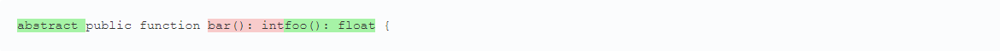

[](https://php.net/)
[](https://www.phpstan.com/)
[](https://app.codecov.io/gh/123inkt/jbdiff)
[](https://github.com/123inkt/jbdiff/actions)
[](https://github.com/123inkt/jbdiff/actions)


# JBDiff

A multi-line diff calcuation library based on Jetbrains' powerful IDE diff implementation.

## Installation
```bash
composer require digitalrevolution/jbdiff
```

## Usage

```php
use DR\JBDiff\ComparisonPolicy;
use DR\JBDiff\JBDiff;

// strings are expected to utf8.
$text1 = "public function bar(): int {";
$text2 = "abstract public function foo(): float {";

// line block will contain all the information to partition the strings in removed, unchanged and added parts.
$lineBlocks = JBDiff::compare($text1, $text2, ComparisonPolicy::DEFAULT);

// to iterate over the string parts
$iterator = new LineBlockIterator($text1, $text2, $lineBlocks);

// format to html
$html = (new LineBlockHtmlFormatter())->format($iterator);
```



### Comparison policies
- `DEFAULT`: the standard diff strategy and will take whitespace differences into account.
- `TRIM_WHITESPACES`: will take leading and trailing whitespaces out of the diff.
- `IGNORE_WHITESPACES`: will take all whitespace differences out of the diff.

## About us

At 123inkt (Part of Digital Revolution B.V.), every day more than 50 development professionals are working on improving our internal ERP 
and our several shops. Do you want to join us? [We are looking for developers](https://www.werkenbij123inkt.nl/zoek-op-afdeling/it).
